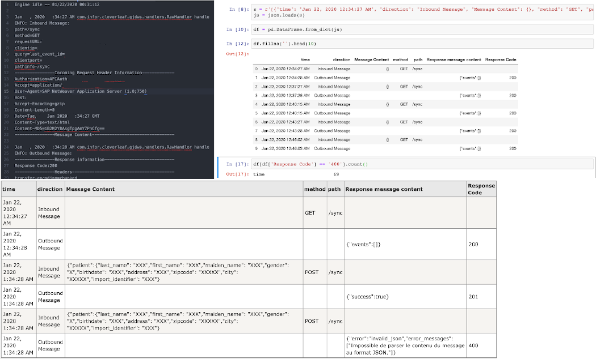

# Introduction
Tool to convert plain-text hospital integration engines' log files to
structured data. Currently supported logfile formats:
- Cloverleaf plain-text log files (NB: This tool is not affiliated with Infor Cloverleaf.)



# How to use
Using git, clone the repository to your working directory:
```bash
cd my_projects
git clone git@github.com:pavlodyban/hospital_logfile_analyzer.git
```

## Prerequisites
This package only support Python 3.

To view and run the Jupyter Notebook, you would best install an
[Anaconda environment](https://docs.anaconda.com/anaconda/install/).

## Command-line interface
You can execute the logfile parser in the command-line of your choice (e.g. bash).
`main.py` implements the command-line argument parser.
Display all options:
```bash
python main.py --help
```

The easiest call to run the application:
```bash
python main.py mylogfile.log output_structured_log.json
```

A more sophisticated application call would involve mapping and/or field filtering:
```bash
python main.py mylogfile.log output_structured_log.json --mappingfile my_mapping.json --filterfile my_filter.json
```
For instructions on how to create field maps and filters,
see the respective sections in text below.

## Jupyter Notebook
You will find examples on how to execute this package in a Jupyter Notebook
inside [jupyter_notebooks](jupyter_notebooks) directory.

## Package
You can use the logfile parser directly in your Python code:
```python
from parsers import parse
parser = parse('test/test.log')
print(len(parser.events))
```

## How to create custom mappings and field filters

### Field Mapping
Fields can be mapped across different levels of hierarchy.
E.g. you can map `root.child1.child2.key1` to `root.key1`.
The mapping allows you to propagate fields from lower levels of hierarchy
to the top. Together with filters,
this allows for very efficient analysis of structured data.

Mapping is given by a JSON dictionary with the source field names being the
keys, and the target field names the values.
The field names inside subtrees are separated by dots.

The following example snippet will copy (or move, depending on the function
parameters) the value of field `Tree.Error Code` into `Error Code`:
```
{
  "Tree.Error Code": "Error Code",
  "Tree.Result.Code": "Result Code"
}
```
The field map has to be stored as a UTF-8 encoded JSON file. For instructions
on how to pass this file to the application, see the CLI or the package usage
documentation in text above.

### Field Filters
Field filters allow to remove fields and subtrees from the structured data.

The following example will remove fields `Tree.Error Code` and will keep
`Tree.Result.Code`:
```
{
  "Tree.Error Code": false,
  "Tree.Result.Code": true
}
```
The field map has to be stored as a UTF-8 encoded JSON file. For instructions
on how to pass this file to the application, see the CLI or the Python package
usage documentation in text above.

# How to test
Execute `run_tests.sh` in your terminal, or run in the root folder of the
package:
```bash
python -m unittest
```

# How to contribute
You can add your own logfile parsers:
1. Inherit `YourOwnParser` from the abstract parent interface [`LogfileParser`](parsers/logfile_parser.py).
2. Add unit tests by adding `test_yourownparser.py` under `test`.

# License
See [LICENSE](LICENSE).
